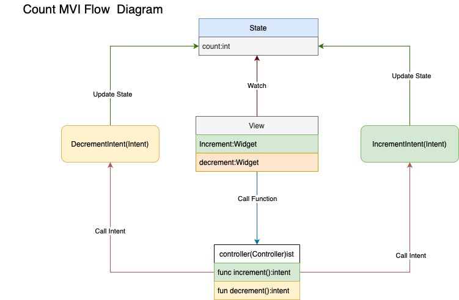

# Counter App with MVI Architecture

A simple Flutter counter app demonstrating the MVI (Model-View-Intent) architecture using Riverpod and the provider package.

## Overview

The MVI architecture separates an application into three components: Model, View, and Intent.

- **Model:** Represents the state of the application. In this app, the `CounterState` class holds the current count.

- **View:** The UI of the application. The `CounterScreen` widget displays the current count and provides buttons to increment and decrement the count.

- **Intent:** Represents user actions that trigger state changes. The `CounterIntent` class defines different user actions, such as incrementing and decrementing the count.

## Project Structure

- `lib/src/presentation/counter/state/state.dart`: Defines the `CounterState` class, representing the state of the counter.

- `lib/src/presentation/counter/intents/increment_intent.dart`: Defines the `IncrementIntent` class, representing user actions to increment.
- `lib/src/presentation/counter/controller/controller.dart`: Implements the `Controller` class, a `StateNotifier` that handles state changes based on user actions.

- `lib/main.dart`: The entry point of the application. It sets up the `ProviderScope` and creates the `CounterScreen` widget.


## Implementation Diagram


## Dependencies

- [flutter](https://flutter.dev/)
- [riverpod](https://pub.dev/packages/riverpod)
- [provider](https://pub.dev/packages/provider)

## How to Run

1. Ensure that you have Flutter installed on your machine.

2. Clone this repository:

   ```bash
   git clone https://github.com/GenSoftMX/JIntent
   ```

3. Navigate to the project directory:

   ```bash
   cd example/counter
   ```

4. Run the app:

   ```bash
   flutter run
   ```

4. Run test:

   ```bash
   flutter test
   ```
## Contributing

Contributions are welcome! Feel free to open issues or pull requests for any improvements or features you'd like to add.

## License
MIT License

Copyright (c) 2020 Remi Rousselet

Permission is hereby granted, free of charge, to any person obtaining a copy of this software and associated documentation files (the "Software"), to deal in the Software without restriction, including without limitation the rights to use, copy, modify, merge, publish, distribute, sublicense, and/or sell copies of the Software, and to permit persons to whom the Software is furnished to do so, subject to the following conditions:

The above copyright notice and this permission notice shall be included in all copies or substantial portions of the Software.

THE SOFTWARE IS PROVIDED "AS IS", WITHOUT WARRANTY OF ANY KIND, EXPRESS OR IMPLIED, INCLUDING BUT NOT LIMITED TO THE WARRANTIES OF MERCHANTABILITY, FITNESS FOR A PARTICULAR PURPOSE AND NONINFRINGEMENT. IN NO EVENT SHALL THE AUTHORS OR COPYRIGHT HOLDERS BE LIABLE FOR ANY CLAIM, DAMAGES OR OTHER LIABILITY, WHETHER IN AN ACTION OF CONTRACT, TORT OR OTHERWISE, ARISING FROM, OUT OF OR IN CONNECTION WITH THE SOFTWARE OR THE USE OR OTHER DEALINGS IN THE SOFTWARE.