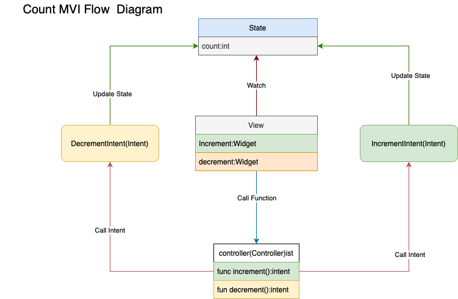

# Counter App with MVI Architecture (Powered by JIntent)

A simple Flutter counter app demonstrating the MVI (Model-View-Intent) architecture, now powered by [JIntent](https://github.com/GenSoftMX/JIntent) to streamline intent handling, state management, and side effects.

---

## Overview

The MVI architecture separates an application into three components: Model, View, and Intent.

- **Model:** Represents the state of the application. In this app, the `CounterState` class holds the current count.

- **View:** The UI of the application. The `CounterScreen` widget displays the current count and provides buttons to increment and decrement the count.

- **Intent:** Represents user actions that trigger state changes. The `CounterIntent` class defines different user actions, such as incrementing and decrementing the count.

With **JIntent**, you also benefit from:
- **Side effect management:** Clean handling of navigation, dialogs, and other one-off UI actions via the side effect stream.
- **Decoupled architecture:** UI interacts with the controller through intents, and responds to state and side effects, promoting a maintainable and scalable codebase.

---

## Project Structure

- `lib/src/presentation/counter/state/state.dart`: Defines the `CounterState` class, representing the state of the counter.
- `lib/src/presentation/counter/intents/increment_intent.dart`: Defines the `IncrementIntent` class, representing user actions to increment.
- `lib/src/presentation/counter/controller/controller.dart`: Implements the `Controller` class, extending `JController` to handle state changes and side effects based on user actions and intents.
- `lib/main.dart`: The entry point of the application. It sets up the `ProviderScope` and creates the `CounterScreen` widget.

---

## Implementation Diagram



---

## Dependencies

- [flutter](https://flutter.dev/)
- [riverpod](https://pub.dev/packages/riverpod)
- [provider](https://pub.dev/packages/provider)
- [JIntent](https://pub.dev/packages/jintent)

---

## What's New with JIntent v2.0.0?

- **Side Effects System:** Use a side effect stream to handle navigation, dialogs, snackbars, and more in a clear, centralized way.
- **UI/Controller Decoupling:** The UI listens to state and side effects; logic is triggered via intents, not by direct controller calls.
- **Dependency Injection Agnostic:** No internal dependency injection—use your favorite approach or manage dependencies manually.

For more details, see the [full changelog](../CHANGELOG.md).

---

## Error Handling in This Example

This example demonstrates **comprehensive error handling patterns** with consistent UX:

### Error Types Demonstrated

1. **Validation Errors** (Red Snackbar 🔴)
   - Try incrementing when counter is at 10
   - Try decrementing when counter is at -10
   - Shows error message with dismiss action

2. **Success Feedback** (Green Snackbar 🟢)
   - Reach milestones (every 10th increment)
   - Automatic positive feedback

3. **Multiple Severity Levels**
   - Error (red) - validation failures
   - Success (green) - milestones
   - Warning (orange) - potential issues
   - Info (blue) - informational messages
   - Dialog - critical errors requiring attention

### Effect Categories

All effects are categorized for analytics:
- `error` - Error snackbars
- `success` - Success feedback
- `warning` - Warning messages
- `info` - Informational messages
- `error_dialog` - Critical error dialogs

### Documentation

For a complete guide to the error handling patterns used in this app, see:
- **[Error Handling Example Guide](./ERROR_HANDLING_EXAMPLE.md)** - Comprehensive documentation
- **[Error Handling Guide](../docs/ERROR_HANDLING_GUIDE.md)** - General patterns and best practices
- **[Global Error Handler Guide](../docs/GLOBAL_ERROR_HANDLER.md)** - Production-ready error handling

---

## How to Run

1. Ensure that you have Flutter installed on your machine.

2. Clone this repository:

   ```bash
   git clone https://github.com/GenSoftMX/JIntent
   ```

3. Navigate to the project directory:

   ```bash
   cd example/counter
   ```

4. Run the app:

   ```bash
   flutter run
   ```

5. Run tests:

   ```bash
   flutter test
   ```

---

## Contributing

Contributions are welcome! Feel free to open issues or pull requests for any improvements or features you'd like to add.

---

## License

MIT License

Copyright (c) 2020 Remi Rousselet

Permission is hereby granted, free of charge, to any person obtaining a copy of this software and associated documentation files (the "Software"), to deal in the Software without restriction, including without limitation the rights to use, copy, modify, merge, publish, distribute, sublicense, and/or sell copies of the Software, and to permit persons to whom the Software is furnished to do so, subject to the following conditions:

The above copyright notice and this permission notice shall be included in all copies or substantial portions of the Software.

THE SOFTWARE IS PROVIDED "AS IS", WITHOUT WARRANTY OF ANY KIND, EXPRESS OR IMPLIED, INCLUDING BUT NOT LIMITED TO THE WARRANTIES OF MERCHANTABILITY, FITNESS FOR A PARTICULAR PURPOSE AND NONINFRINGEMENT. IN NO EVENT SHALL THE AUTHORS OR COPYRIGHT HOLDERS BE LIABLE FOR ANY CLAIM, DAMAGES OR OTHER LIABILITY, WHETHER IN AN ACTION OF CONTRACT, TORT OR OTHERWISE, ARISING FROM, OUT OF OR IN CONNECTION WITH THE SOFTWARE OR THE USE OR OTHER DEALINGS IN THE SOFTWARE.